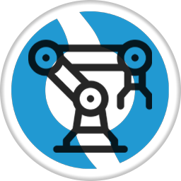
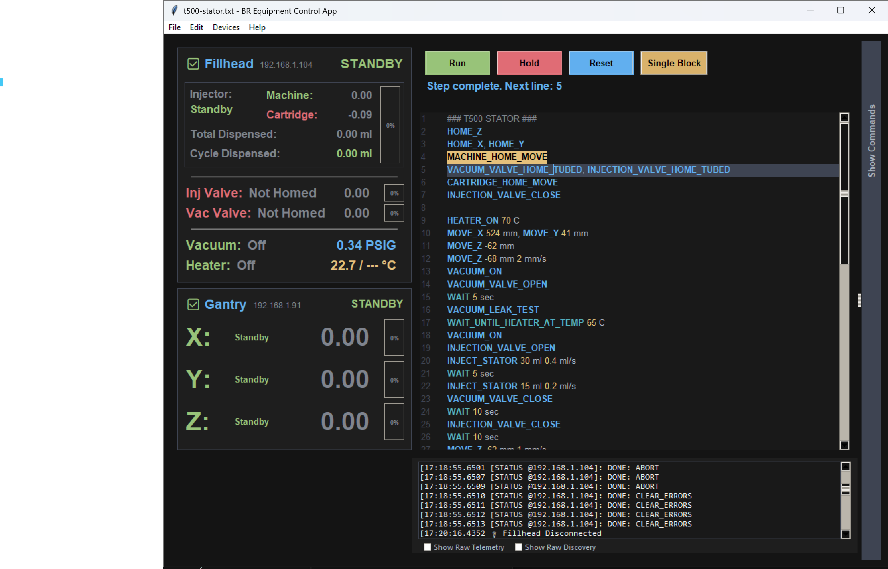

<div align="center">



# BR Equipment Control App

**Multi-Device Manufacturing Equipment Control & Automation**

[](https://github.com/bluerobotics/br-equipment-control-app/releases/latest)
[](https://github.com/bluerobotics/br-equipment-control-app/actions)
[](https://github.com/bluerobotics/br-equipment-control-app/releases)
[](LICENSE)
[](https://github.com/bluerobotics/breq-scripts)

[View Changelog](CHANGELOG.md) • [Download Latest Release](https://github.com/bluerobotics/br-equipment-control-app/releases/latest)

</div>

---

## Known Devices

| Device | Description | Repository |
|--------|-------------|------------|
| **Pressboi** | Dual-motor press control | [bluerobotics/pressboi](https://github.com/bluerobotics/pressboi) |
| **Fillhead** | Automated filling system | [bluerobotics/fillhead](https://github.com/bluerobotics/fillhead) |
| **Gantry** | XYZ motion control | [bluerobotics/gantry](https://github.com/bluerobotics/gantry) |

---

## 1. Overview

Open-source desktop application for controlling and automating manufacturing equipment built on ClearCore microcontrollers. Designed for production environments where multiple devices need to work together in coordinated sequences.

<p align="center">
  
</p>

The application provides a unified interface for scripting, monitoring, and debugging custom manufacturing equipment. Communicate over USB serial or Ethernet, write automation scripts in a simple text format, log telemetry data for analysis, and flash firmware updates without leaving the app. Device definitions are modular - add new equipment types by creating JSON schemas and custom GUI panels.

**Key Capabilities:**
- **Multi-Device Scripting**: Coordinate actions across multiple devices with simple text-based scripts (`.breq` files)
- **Dual Communication**: USB and Ethernet connectivity with automatic discovery and failover
- **Data Logging**: Export telemetry to CSV with millisecond timestamps for analysis in Excel or other tools
- **Firmware Management**: Flash firmware updates over USB or network with version tracking
- **Error Diagnostics**: View device error logs and 24-hour heartbeat history for debugging connectivity issues
- **Simulation Mode**: Test scripts without hardware using built-in device simulators
- **Modular Architecture**: Add new device types by defining JSON schemas - the app auto-generates C++ parsers for firmware

---

## 2. Features

- **Scripting**: Text-based automation with syntax highlighting, validation, and step-through debugging
- **Data Logging**: CSV export with millisecond timestamps and variable queueing
- **Device Management**: USB and network connectivity with automatic discovery and recovery
- **Error Diagnostics**: Built-in error log viewer with 24-hour heartbeat tracking
- **Firmware Updates**: Over-the-air firmware flashing with version management
- **Simulation**: Test scripts without hardware using built-in device simulators
- **Code Generation**: Auto-generate C++ command parsers and telemetry handlers from JSON definitions
- **Auto-Recovery**: Unsaved scripts and crash recovery

---

## 3. System Architecture

Multi-threaded Python application with modular device support.

### 3.1. Core Modules

- **Device Manager**: Loads device definitions from `/devices` directory, maintains connection state, routes telemetry
- **Comms**: UDP network and USB serial communication with automatic discovery and reconnection
- **Script Processor**: Executes `.breq` scripts in background thread with validation and error handling
- **Data Logger**: CSV export with variable queueing and timestamp tracking
- **Command Reference**: Interactive tree view of all commands/variables with right-click operations
- **Firmware Manager**: OTA firmware updates with version tracking and GitHub integration

---

## 4. Data Logging

### 4.1. Using the UI

1. Right-click variables in the Command Reference and select "Queue for Logging"
2. Right-click the device and select "Start Logging..."
3. Stop logging via device context menu or global abort

Variables show `[queued]` (blue) and `[logging]` (yellow) indicators.

### 4.2. Using Scripts

```
# Queue variables for logging
queue_for_logging
    fillhead.temp_c
    fillhead.heater_setpoint
    fillhead.vacuum_psig

queue_for_logging
    gantry.x_pos
    gantry.y_pos
    gantry.z_pos

# Start logging queued variables from both devices to one file
start_logging "<date>-<time> test_data.csv" fillhead gantry

# Run your test
wait 60

# Stop all logging
stop_logging
```

### 4.3. CSV Format

Files are saved to `logs/` with columns: `date`, `time_ms`, `elapsed_s`, followed by logged variables.

Each device writes values to its columns when it sends telemetry. Other columns remain blank for that row.

Use `<date>` and `<time>` in filenames for automatic timestamps:
```
start_logging "<date>-<time> data.csv" fillhead
```

Collisions are resolved by appending `_1`, `_2`, etc.

---

## 5. Error Diagnostics

View device error logs and connection history via **Devices → Dump Error Log...**

Devices maintain two circular buffers:
- **Error Log**: 100 entries of system events, warnings, and errors
- **Heartbeat Log**: 2880 entries (24 hours) of USB/network status sampled every 30 seconds

Use this to diagnose intermittent connectivity issues, watchdog timeouts, or firmware errors.

---

## 6. Scripting

Scripts use the `.breq` (BR Equipment) file extension and are plain text files.

### 5.1. Built-In Commands

| Command | Example |
|---------|---------|
| `wait` | `wait 5` |
| `wait_for` | `wait_for gantry.x_pos > 100` |
| `cycle` | `cycle 10` |
| `queue_for_logging` | `queue_for_logging fillhead.temp_c` |
| `unqueue_for_logging` | `unqueue_for_logging fillhead.temp_c` |
| `start_logging` | `start_logging "data.csv" fillhead gantry` |
| `stop_logging` | `stop_logging` |

### 5.2. Syntax

```
# Comments start with #

# Device commands
gantry.home_x
gantry.move_x 100 1000
fillhead.set_temp 25.5

# Loops with indented blocks
cycle 5
    gantry.move_x 10
    wait 1

# Logging with indented blocks
queue_for_logging
    fillhead.temp_c
    fillhead.heater_setpoint

start_logging "test.csv" fillhead
wait 10
stop_logging
```

Scripts are validated before execution. Devices must be connected to run.

---

## 7. Device Structure

### 7.1. Overview

Each device is a folder under `/devices/` containing:

- **`commands.json`**: Scriptable commands (e.g., `move_x`, `home`, `set_temp`)
- **`telemetry.json`**: Real-time variables (e.g., `x_pos`, `temp_c`, `pressure`)
- **`events.json`**: Asynchronous notifications (e.g., `homed`, `error`)
- **`gui.py`**: Custom status panel for the device

### 7.2. Adding Devices

**Via UI (Recommended):**
1. Right-click Command Reference → "Add Device..."
2. Right-click device → "Add Command..." or "Add Variable..."
3. Use **File → Generate C++ Code** to create firmware headers

**Manual JSON:**
Copy an existing device folder and edit the JSON files directly. Useful for bulk operations.

### 7.3. Using the Command Reference

The Command Reference panel shows all devices, commands, and variables:
- **Click** any command → copies to clipboard for script use
- **Right-click** variable → "Queue for Logging"
- **Right-click** device → "Add Command/Variable" or "Start Logging..."
- **Right-click** item → "Delete" to remove

Changes save immediately to JSON and update the UI.

### 7.4. JSON File Reference

#### `commands.json`
```json
{
  "move_x": {
    "device": "gantry",
    "target": "device",
    "params": [
      { "parameter": "distance", "type": "float", "unit": "mm" }
    ],
    "returns": ["done", "error"],
    "description": "Moves X-axis by relative distance"
  }
}
```
Script usage: `gantry.move_x 100`

#### `telemetry.json`
```json
{
  "x_pos": {
    "type": "float",
    "default": 0.0,
    "unit": "mm",
    "precision": 2
  },
  "main_state": {
    "type": "string",
    "default": "standby",
    "map": { "standby": "Standby", "busy": "Busy" }
  }
}
```

#### `events.json`
```json
{
  "homed": {
    "device": "gantry",
    "description": "Emitted when homing completes"
  }
}
```
Script usage: `wait_for gantry.homed`

#### `gui.py`
Creates the device status panel:
```python
def get_gui_variable_names():
    return ['gantry_x_pos_var', 'gantry_state_var']

def create_gui_components(parent, shared_gui_refs):
    frame = ttk.Frame(parent)
    x_pos_var = shared_gui_refs.get('gantry_x_pos_var')
    ttk.Label(frame, textvariable=x_pos_var).pack()
    return frame
```

### 7.5. C++ Code Generation

Use **File → Generate C++ Code** to auto-generate firmware headers from JSON:
- `commands.json` → `commands.h`, `command_parser.h/cpp`
- `telemetry.json` → `telemetry.h/cpp`
- `events.json` → `events.h/cpp`

This keeps Python app and C++ firmware synchronized.

---

## 8. Network Protocol

UDP on port 6272, ASCII strings.

```
# Discovery
App → Broadcast: DISCOVER_DEVICE
Device → App: DISCOVERY_RESPONSE: DEVICE_ID=gantry PORT=8889

# Commands
App → Device: MOVE_X:100:1000
Device → App: GANTRY_STATUS:MOVE_X:100:1000:DONE

# Telemetry (10Hz)
Device → App: GANTRY_TELEM:x_pos=123.45;y_pos=67.89;x_homed=1

# Events
Device → App: GANTRY_EVENT:HOMED
```

Messages are prefixed with device name in uppercase.

---

## 9. Setup

### Option 1: Pre-built Executables (Recommended for End Users)

Download the latest release for your platform from the [Releases page](https://github.com/bluerobotics/br-equipment-control-app/releases):

- **Windows:** Download and extract the `.zip` file, then run `BR-Equipment-Control.exe`
- **macOS:** Download the `.dmg` file, drag the app to Applications
- **Linux:** Download and extract the `.tar.gz` file, then run `./BR-Equipment-Control`

No Python installation required! See [DISTRIBUTION.md](DISTRIBUTION.md) for details.

### Option 2: Run from Source (For Developers)

Python 3.10+, no external dependencies

```bash
python main.py
```

Creates `logs/` directory on first run.

---

## 10. Keyboard Shortcuts

| Shortcut | Action |
|----------|--------|
| `Ctrl+N` | New Script |
| `Ctrl+O` | Open Script |
| `Ctrl+S` | Save Script |
| `Ctrl+Shift+S` | Save As |
| `Ctrl+Z` | Undo |
| `Ctrl+Y` | Redo |
| `Ctrl+X` | Cut |
| `Ctrl+C` | Copy |
| `Ctrl+V` | Paste |
| `Ctrl+F` | Find |
| `Ctrl+H` | Replace |
| `Ctrl+Shift+V` | Validate Script |

---

## 11. Troubleshooting

**Devices not discovered:** Check network, verify UDP port 6272 is accessible, restart simulators

**Script errors:** Use File → Validate Script. Check devices exist in `/devices` and are connected.

**Logging not working:** Queue variables first, ensure devices are connected

**Timeouts:** Devices timeout after 3 seconds without telemetry

---

## 12. Related Projects

### Firmware
- **[Pressboi](https://github.com/bluerobotics/pressboi)** - Dual-motor press control firmware for ClearCore
- **[Fillhead](https://github.com/bluerobotics/fillhead)** - Automated filling system firmware
- **[Gantry](https://github.com/bluerobotics/gantry)** - XYZ gantry motion control firmware

### Scripts
- **[BR Equipment Scripts](https://github.com/bluerobotics/breq-scripts)** - Production automation scripts for manufacturing equipment

---

## 13. License

This project is licensed under the MIT License - see the [LICENSE](LICENSE) file for details.

Copyright (c) 2025 Blue Robotics

---

## 14. Contributing

For issues, feature requests, or contributions, please open an issue or pull request on GitHub.

---

<div align="center">

⭐ **Star us on GitHub if you found this useful!**

Made with 💙 by the Blue Robotics team and contributors worldwide

---


**[bluerobotics.com](https://bluerobotics.com)** | Manufacturing Equipment Control

</div>
